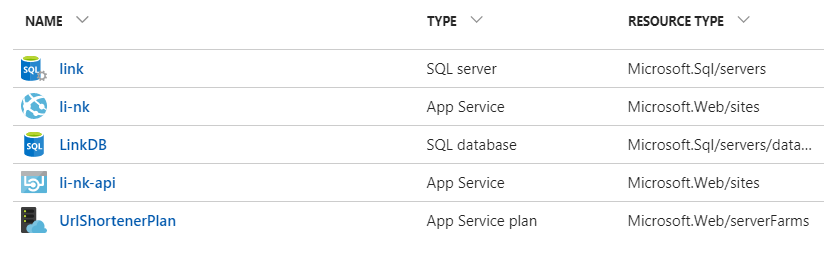
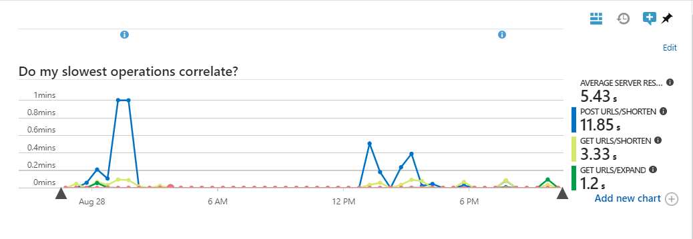
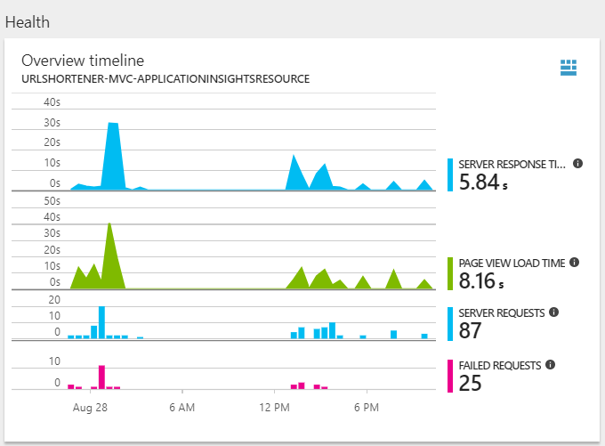
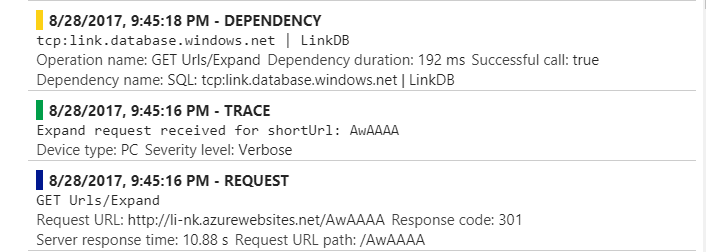
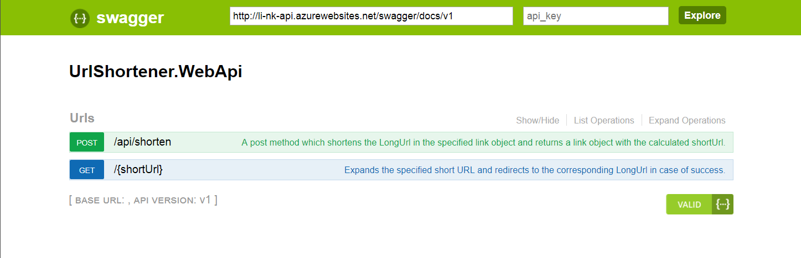
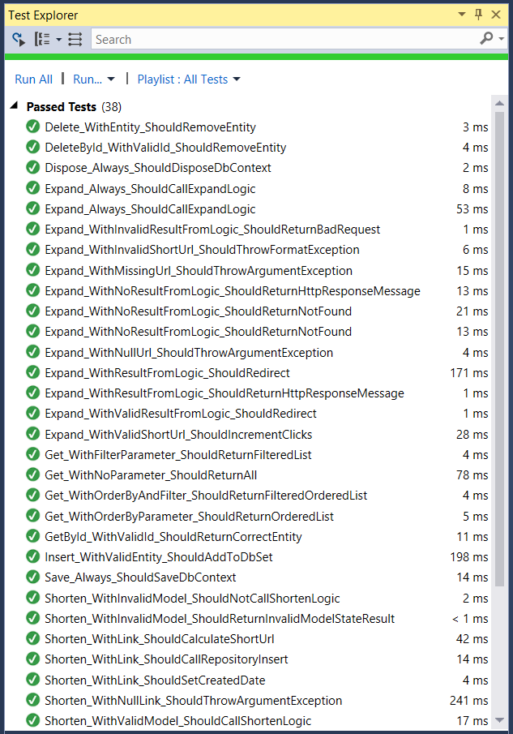

# Link, A Url Shortener
   
This is a sample Url shortener application named Link.  
  
You can shorten URLs to make them easier to share using the Link URL shortener.  
For example, the short URL [li-nk.azurewebsites.net/AwAAAA](http://li-nk.azurewebsites.net/AwAAAA) takes people to https://github.com/MohammadChamanpara/Link-UrlShortener/blob/master/README.md  
  
_Not that short on Azure though :)_  
  
## Create a shortened URL
  1. Visit the Link URL shortener site at [li-nk.azurewebsites.net](http://li-nk.azurewebsites.net).
  1. Write or paste your URL in the Long URL box.
  1. Click Shorten URL.
  1. Below the “Shorten Url” button, you’ll see the short version of your url. 
  1. Copy the generated url or just click on it to have it opened in a new browser tab.

## Table of contents

  * [Link, A Url Shortener](#link-a-url-shortener)
  * [Create a shortened URL](#create-a-shortened-url)
  * [Table of contents](#table-of-contents)  
  * [Implementation Notes](#implementation-notes)  
  * [Working Instance on Azure](#working-instance-on-azure)
  * [Azure Application Insights](#azure-application-insights)
  * [REST API](#rest-api)
  * [Unit Tests](#unit-tests)
  * [Solution Structure](#solution-structure)
  * [Acknowledgements](#acknowledgements)

## Implementation Notes
It is tried to design the structure of the application to be highly extensible and easily maintainable.
Implementation and design best practices have been employed to serve as means to create a well crafted testable code.
Although the implementation has taken place in a limited time frame, therefore there are several points of improvement.
  
In this project, Microsoft Asp.Net MVC is used for the UI and Microsoft Asp.Net WebApi for the implemented API of the application.
Dependency Injection is enabled thanks to the Microsoft Unity and some frameworks such as Moq and FluentAssertions are used for Mocking and assertions in the unit tests.

EntityFramework connects us to the SQL server database, and UnitOfWork and Repository patterns are implemented to decouple the other layers from the DataAccess Details. Code first approach is used for the various benefits including but not limited to having full control over the code, Generating database on the first start, no auto generated code, keep track of the DB changes in Source Control, etc. 

The logic of the application is injected in, using the strategy pattern. Currently, the implementation is based on storing the data in a database and using the auto generated id to produce a hash as a short url. This can be replaced with another approach in a convenient manner.  
  
A custom logger is implemented based on Azure Application insight and sends application event logs and exceptions as telemetry data to Azure.

## Working Instance on Azure
A working instance of the Link application is deployed to a Microsoft Azure Web App and accessible via [li-nk.azurewebsites.net](http://li-nk.azurewebsites.net). The API of the application is also deployed to an API App and can be accessed and consumed by client applications via [li-nk-api.azurewebsites.net](http://li-nk-api.azurewebsites.net/)  
  
An Azure SQL Data Base is the used data storage for the deployed instances of the project.  
  
  

## Azure Application Insights
Azure Application insight has been employed for the application in order to diagnose exceptions and application performance issues. It is used to monitor the application and automatically detect performance anomalies.  
  
  
  
  
  
The custom logging mechanism of the application is also based on the Application Insights and collects traces, exceptions, and all the application events of various severities and sends to Azure Application Insights.  
  
  
  
## REST API
A RESTful API layer is provided for the client applications to consume and use url shortening facilities.
Asp.Net WebApi 2.0 is used for the implementation and the API is available on an Azure API App  [li-nk-api.azurewebsites.net](http://li-nk-api.azurewebsites.net) and ready to be consumed.  
  
Swashbuckle swagger is enabled for the API for easier use and having a simple documentation on API.  
  
    
  
Application insight features are also available on this layer and trace and diagnostic data are actively being sent to Azure Application Insight resource.

## Unit Tests
A number of unit tests are prepared for each project of the application. Unit tests for each project are organized in a separate project. MSTest is the test framework used and FluentAssertions and Moq are the assertion and mocking frameworks. It is tried to show different examples, while the coverage can be improved.  
  
     
  
## Solution Structure
  1. __UrlShortener.Core__: Common facilities, helpers, and models are stored in this project.  
  1. __UrlShortener.UI__: This is an MVC application serving as the UI of the project.  
  1. __UrlShortener.UI.Tests__: unit tests of the UI project.  
  1. __UrlShortener.WebApi__: API of the application which is not used by any other layer and is ready to be consumed in any front end client.  
  1. __UrlShortener.WebApi.Tests__: unit tests of the API project.  
  1. __UrlShortener.Logic__: this layer contains the url service, responsible for the business logic of the application.  
  1. __UrlShortener.Logic.Tests__: unit tests of the logic layer.  
  1. __UrlShortener.DataAccess__ This layer contains the data base context, unit of work, repositories, code first migration classes and so on.  
  1. __UrlShortener.DataAccess.Tests__: data access layer tests.  
  1. __UrlShortener.Loggers.ApplicationInsights__: An implementation of the ILogger interface which uses Azure application insights as an underlying framework to log application events.  
    
    
  
## Acknowledgements
  I am willing to extend my gratitude to those who initiated this urge in me to start working on this project.  
  I hope the high respect I have for my product is demonstrated through this project.

